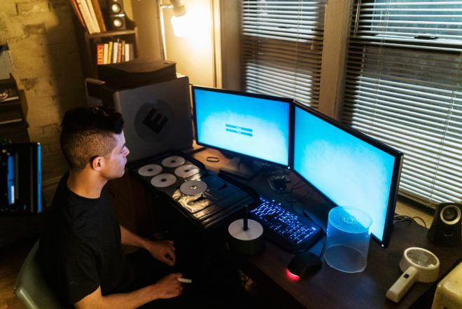

<h3>✦✦ NENOSB33 // PROFILE✦✦</h3>

 

  

<code>ACCESSING USER PROFILE...</code>

  

<h3>Computer Information Systems Student</h3>

 

I'm fascinated by the way technology works — 
from networks and systems to cybersecurity, 
data, programming and digital design.

  

✦ <b>CYBERSECURITY</b>
&nbsp;&nbsp; ✦
<b>DATA ANALYSIS</b>

  

✦ <b>SYSTEMS & NETWORKS</b>
&nbsp;&nbsp; ✦
<b>PROGRAMMING</b>

  

✦ <b>UI / WEB DESIGN</b>

  

<code>STATUS :: ONLINE</code>
&nbsp;&nbsp; ✦ &nbsp;&nbsp;
<code>ACCESS :: GRANTED</code>

  

✧･ﾟ: *✧･ﾟ:* ✦ *:･ﾟ✧*:･ﾟ✧

  

<!-- ═══════════════════════════════════════════════════════════ -->
<!--                    // SYSTEM MINDSET //                     -->
<!-- ═══════════════════════════════════════════════════════════ -->

<h2>⌁ BUILDING MY OWN SYSTEM ⌁</h2>

 

<h3>✦ SYSTEM MINDSET</h3>

<code>LEARN</code>
&nbsp; ✦ &nbsp;
<code>ANALYZE</code>
&nbsp; ✦ &nbsp;
<code>CREATE</code>

  

<code>EXPERIMENT</code>
&nbsp; ✦ &nbsp;
<code>BREAK</code>
&nbsp; ✦ &nbsp;
<code>REBUILD</code>

  

Understanding technology is not enough. 
I want to understand <b>why</b> it works.

     

✧･ﾟ: *✧･ﾟ:* ✦ *:･ﾟ✧*:･ﾟ✧

  

<!-- ═══════════════════════════════════════════════════════════ -->
<!--                      // TECH STACK //                       -->
<!-- ═══════════════════════════════════════════════════════════ -->

<h2>◈ TECH STACK ◈</h2>

 

  

  

<h3>PROGRAMMING</h3>

  

<h3>DATA / DATABASE</h3>

  

<h3>SYSTEMS / CLOUD / HARDWARE</h3>

  

<code>[ STACK INITIALIZED ]</code>

  

✦ ──────── ◈ ──────── ✦

  

<!-- ═══════════════════════════════════════════════════════════ -->
<!--                       // INTERESTS //                       -->
<!-- ═══════════════════════════════════════════════════════════ -->

<h2>✦ INTERESTS ✦</h2>

 

🔐 <b>CYBERSECURITY</b>
&nbsp;&nbsp; ✦ &nbsp;&nbsp;
🕵️ <b>ETHICAL HACKING</b>

  

🌐 <b>NETWORKS</b>
&nbsp;&nbsp; ✦ &nbsp;&nbsp;
💻 <b>PROGRAMMING</b>
&nbsp;&nbsp; ✦ &nbsp;&nbsp;
🤖 <b>AI</b>

  

📊 <b>DATA</b>
&nbsp;&nbsp; ✦ &nbsp;&nbsp;
📡 <b>IoT</b>
&nbsp;&nbsp; ✦ &nbsp;&nbsp;
☁️ <b>CLOUD</b>

  

🎨 <b>UI / WEB</b>
&nbsp;&nbsp; ✦ &nbsp;&nbsp;
🎯 <b>CTF</b>

  

♟️ <b>CHESS</b>
&nbsp;&nbsp; ✦ &nbsp;&nbsp;
🎮 <b>CALL OF DUTY</b>

  

✧･ﾟ: *✧･ﾟ:* ✦ *:･ﾟ✧*:･ﾟ✧

  

<!-- ═══════════════════════════════════════════════════════════ -->
<!--                  // LEARNING PROTOCOL //                    -->
<!-- ═══════════════════════════════════════════════════════════ -->

<h2>⌁ CURRENTLY LEARNING ⌁</h2>

 

<h3>✦ LEARNING PROTOCOL</h3>

<code>CYBERSECURITY</code>
&nbsp; ◈ &nbsp;
<code>DATA ANALYSIS</code>

  

<code>NETWORKS</code>
&nbsp; ◈ &nbsp;
<code>PROGRAMMING</code>

  

<code>WEB DEVELOPMENT</code>
&nbsp; ◈ &nbsp;
<code>UI / UX</code>

  
  

<code>SOFTWARE DEVELOPMENT</code>

  

<code>████████████████████░░░░░░░░░░</code>

  

<b>STATUS :: IN PROGRESS_</b>

     

✦ ────────── ◈ ────────── ✦

  

<!-- ═══════════════════════════════════════════════════════════ -->
<!--                     // PROJECTS //                          -->
<!-- ═══════════════════════════════════════════════════════════ -->

<h2>◈ PROJECTS ◈</h2>

 

  
  

<h3>PROJECT DATABASE</h3>

<code>SCANNING REPOSITORIES...</code>

  

✦ <b>PROJECTS IN DEVELOPMENT</b>

  

<code>NEW PROJECTS ARE BEING BUILT...</code>

  

<code>STATUS :: WORK IN PROGRESS</code>

  

✧･ﾟ: *✧･ﾟ:* ✦ *:･ﾟ✧*:･ﾟ✧

  

<!-- ═══════════════════════════════════════════════════════════ -->
<!--                       // GAMING //                          -->
<!-- ═══════════════════════════════════════════════════════════ -->

<h2>♟ GAMING // 🎮</h2>

  
 

<b>♟ CHESS</b>

 

Strategy • Patience • Calculation

  

  

<b>🎮 CALL OF DUTY</b>

 

Focus • Reaction • Teamwork

  
  

<code>GAME MODE :: ONLINE</code>

&nbsp;&nbsp;

<code>PLAYER :: READY_</code>

  

✦ ─────────────── ✦

  

<!-- ═══════════════════════════════════════════════════════════ -->
<!--                    // GITHUB STATS //                       -->
<!-- ═══════════════════════════════════════════════════════════ -->

<h2>◈ GITHUB STATS ◈</h2>

 

 

    

✦ ✧ ✦ ✧ ✦

  

<!-- ═══════════════════════════════════════════════════════════ -->
<!--                       // ACTIVITY //                        -->
<!-- ═══════════════════════════════════════════════════════════ -->

<h2>✦ ACTIVITY ✦</h2>

 

  

✧･ﾟ: *✧･ﾟ:* ✦ *:･ﾟ✧*:･ﾟ✧

  

<!-- ═══════════════════════════════════════════════════════════ -->
<!--                  // CONTRIBUTION //                         -->
<!-- ═══════════════════════════════════════════════════════════ -->

<h2>⌁ CONTRIBUTION PROTOCOL ⌁</h2>

 

  

<code>INITIALIZING CONTRIBUTION SCAN...</code>

  

✦ MAPPING ACTIVITY ✦

  

✧ GENERATING CONTRIBUTION DATA ✧

  

<code>[ CONTRIBUTION SYSTEM // ONLINE ]</code>

  

✦ ────────── ◈ ────────── ✦

  

<!-- ═══════════════════════════════════════════════════════════ -->
<!--                       // CONNECT //                         -->
<!-- ═══════════════════════════════════════════════════════════ -->

<h2>✦✦✦ CONNECT ✦✦✦</h2>

 

<!-- ═══════════════════════════════════════════════════════════ -->
<!--                       // CONNECT //                         -->
<!-- ═══════════════════════════════════════════════════════════ -->

 

  

  

✦･ﾟﾟ･:｡..｡:*ﾟ::✼✿

  

<pre>
CONNECTION TERMINATED_

"BORN TO WIN"

Ease your body with work and don't tire it with rest.

SEE YOU ON THE OTHER SIDE.

[ SYSTEM OFFLINE ]
</pre>

</html>
