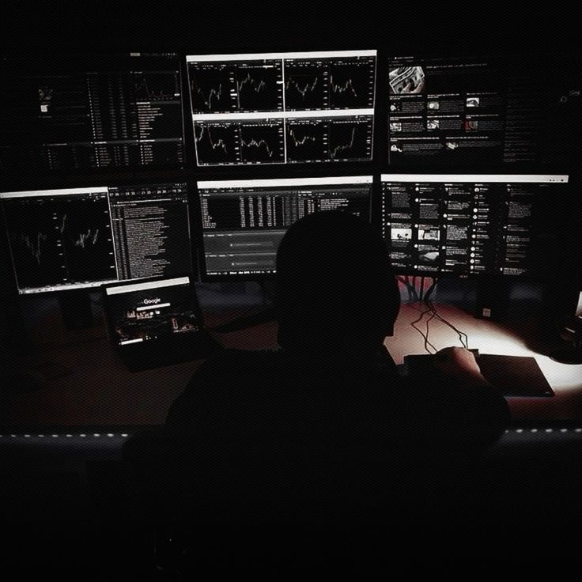

<html>

    
<!-- ═══════════════════════════════════════════════════════════ -->
<!--                    RTJ // SYSTEM                            -->
<!-- ═══════════════════════════════════════════════════════════ -->

 

### `Ease your body with work and don't tire it with rest.`

 

 

  

  

 

<table>
<tr>
<td width="65%" valign="middle">

<h2>WHO AM I</h2>

<pre>
┌──[ NENOSB33@github ]─[~]
│
├── $ whoami
│
│   Computer Information Systems Student
│
├── $ interests
│
│   Cybersecurity
│   Data Analysis
│   Systems & Networks
│   Programming
│   UI / Web Design
│
├── $ mission
│
│   Become professional in cybersecurity,
│   data analysis and digital design.
│
└── $ status

    [ ONLINE ] ████████████████████ 100%
</pre>

</td>

<td width="35%" align="center">

</td>
</tr>
</table>

 

### `BUILDING MY OWN SYSTEM`

I'm interested in understanding how technology works —  
from systems and networks to programming, cybersecurity,  
data analysis, and digital design.

 

`LEARN` • `ANALYZE` • `CREATE` • `EXPERIMENT` • `IMPROVE`

 

<table>
<tr>
<td width="35%" align="center">

</td>

<td width="65%" valign="middle">

<h2>TECH STACK</h2>

<b>PROGRAMMING</b>

  

  

<b>DATA / DATABASE</b>

  

  

<b>SYSTEMS / CLOUD / HARDWARE</b>

  

</td>
</tr>
</table>

 

<h2>INTERESTS</h2>

`🔐 Cybersecurity` &nbsp; `🕵️ Ethical Hacking`  
`🎯 CTF` &nbsp; `🌐 Networks`  
`💻 Programming` &nbsp; `🤖 AI`  
`📡 IoT` &nbsp; `☁️ Cloud`  
`🎨 UI / Web Design` &nbsp; `📊 Data Analysis`  
`♟️ Chess` &nbsp; `🎮 Call of Duty`

 

<table>
<tr>
<td width="65%" valign="middle">

<h2>CURRENTLY LEARNING</h2>

<pre>
[ LEARNING PROTOCOL ]

██████████████████░░░░░░░░░░░░░░░░░░

CYBERSECURITY
DATA ANALYSIS
NETWORKS
PROGRAMMING
WEB DEVELOPMENT
UI / UX DESIGN
SOFTWARE DEVELOPMENT

> STATUS: IN PROGRESS_
</pre>

</td>

<td width="35%" align="center">

</td>
</tr>
</table>

 

<table>
<tr>
<td width="35%" align="center">

</td>

<td width="65%" valign="middle">

<h2>PROJECTS</h2>

<pre>
┌──────────────────────────────────────┐
│       PROJECT DATABASE               │
├──────────────────────────────────────┤
│                                      │
│  > SCANNING REPOSITORIES...          │
│                                      │
│  [!] PROJECTS IN DEVELOPMENT         │
│                                      │
│  > NEW PROJECTS ARE BEING BUILT...   │
│                                      │
│  STATUS :: WORK IN PROGRESS          │
│                                      │
└──────────────────────────────────────┘
</pre>

</td>
</tr>
</table>

 

<h2>GAMING</h2>

♟️ <b>CHESS</b>  
Strategy • Patience • Calculation
  

🎮 <b>CALL OF DUTY</b>  
Focus • Reaction • Teamwork

  

`GAME MODE: ONLINE`  
`PLAYER STATUS: READY_`

 

<table>
<tr>
<td width="65%" valign="middle">

<h2>GITHUB STATS</h2>

  

</td>

<td width="35%" align="center">

</td>
</tr>
</table>

 

<h2>ACTIVITY</h2>

 

<table>
<tr>
<td width="35%" align="center">

</td>

<td width="65%" valign="middle">

<h2>CONTRIBUTION PROTOCOL</h2>

<pre>
> INITIALIZING CONTRIBUTION SCAN...

> MAPPING ACTIVITY...

> GENERATING SNAKE...

[ CONTRIBUTION SYSTEM // LOADING... ]
</pre>

</td>
</tr>
</table>

 

<h2>CONNECT</h2>

  

  

<pre>
╔══════════════════════════════════════════════════════════════╗
║                                                              ║
║                  CONNECTION TERMINATED_                      ║
║                                                              ║
║                    "BORN TO WIN"                             ║
║                                                              ║
║      Ease your body with work and don't tire it with rest.   ║
║                                                              ║
║                  SEE YOU ON THE OTHER SIDE.                  ║
║                                                              ║
╚══════════════════════════════════════════════════════════════╝

[ SYSTEM OFFLINE ]
</pre>

</html>
